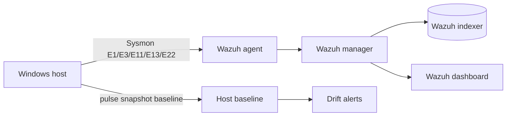

# soc-lab

> A home SOC lab: **Wazuh** (single-node) + **Sysmon** telemetry + custom
> detection rules + hunt playbooks. Blue-team practice environment, documented
> end-to-end — the collection stack behind the `detection-rules` repo.

## Why a lab

Detection engineering without a lab is guesswork. This lab is where the rules
in the `detection-rules` repo are tuned against *real* Windows telemetry
instead of intuition — and where the `dfir-writeups` scenarios were built.
It is also the environment where `pulse` (the host-drift tripwire) gets its
baselines.

## Architecture



| Layer | Component | Purpose |
| --- | --- | --- |
| Telemetry | Sysmon (event IDs 1, 3, 5, 7, 11, 13, 22) | Process, network, file, registry, DNS visibility |
| Collection | Wazuh agent | Ships Windows events to the manager |
| Platform | Wazuh manager + indexer + dashboard | Alerting, FIM, active response, dashboards |
| Baseline | `pulse` snapshot/diff | Host drift tripwire (process tree + TCP table) |
| Detection | Custom rules + Sigma → Wazuh conversions | The `detection-rules` repo mapped onto the lab |

## Quickstart

```sh
# 1. Bring up the Wazuh stack (single node, pinned 4.9.x)
docker compose -f wazuh/docker-compose.yml up -d

# 2. Install the Wazuh agent on the Windows host
#    (official installer; use the manager address from the compose output)

# 3. Ship Sysmon events into Wazuh
#    - Install Sysmon with the config in sysmon/sysmon-config.xml
#    - Apply the agent ossec.conf snippets in wazuh/agent-ossec-snippets.conf

# 4. Load the custom detection rules
cp wazuh/custom-rules.xml /var/ossec/etc/rules/local_rules.xml

# 5. Build a host baseline with pulse
pulse snapshot > baseline.json
```

> The compose file tracks the **layout and pinned versions** used by this lab;
> generated configuration files (indexer certs, dashboard settings) follow the
> official Wazuh single-node quickstart and are intentionally not committed
> here (gold-only, like the rest of the portfolio).

## What's in here

| Path | Content |
| --- | --- |
| `sysmon/sysmon-config.xml` | Minimal-but-meaningful Sysmon config (E1, E3, E5, E7, E11, E13, E22) |
| `wazuh/docker-compose.yml` | Single-node Wazuh stack (manager, indexer, dashboard), pinned images |
| `wazuh/custom-rules.xml` | Custom rules: run-key persistence, new external connections, suspicious child processes |
| `wazuh/agent-ossec-snippets.conf` | `ossec.conf` snippets: sysmon channel, PowerShell 4104 channel |
| `playbooks/hunt-playbook.md` | Reusable daily threat-hunt checklist (ATT&CK-aligned) |
| `playbooks/triage-playbook.md` | Alert triage flow, from first alert to containment |

## Sample detection chain

1. Sysmon E13 fires on `HKCU\...\Run` write (registry).
2. Wazuh rule (custom-rules.xml) raises severity when the value points to a
   non-standard path like `AppData\Local\Temp`.
3. Cross-check: `pulse diff` shows a new external connection from the same
   host — the drift that ties the alert to a real chain.
4. Confirm with a `detection-rules` YARA scan of the dropped binary.

## Status / honesty

- This repo documents the *lab as built*. Wazuh stack configs follow the
  official quickstart; the custom parts (rules, sysmon config, playbooks,
  pulse integration) are original and version-controlled here.
- Screenshots: to be added after the next lab rebuild (`docs/screenshots/`).

## License

Apache-2.0 + Commons Clause. Commercial rights reserved to the copyright
owner — you may use/modify/host it freely for non-commercial purposes and as a
capability showcase, but may not sell it or a product derived from it without a
commercial license (see LICENSE).
